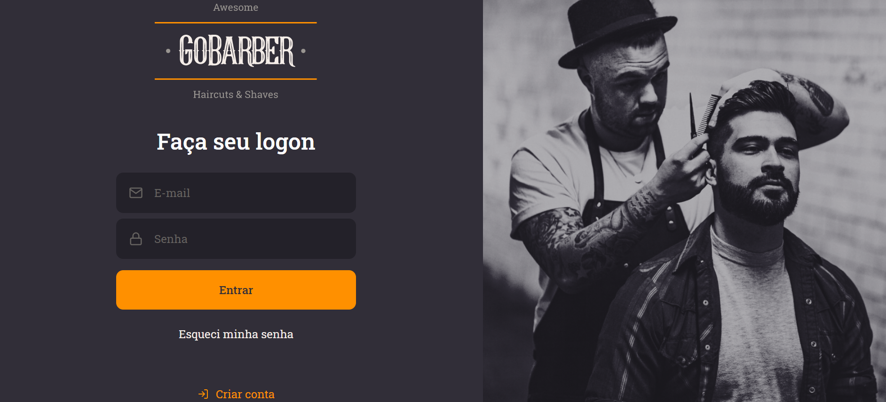
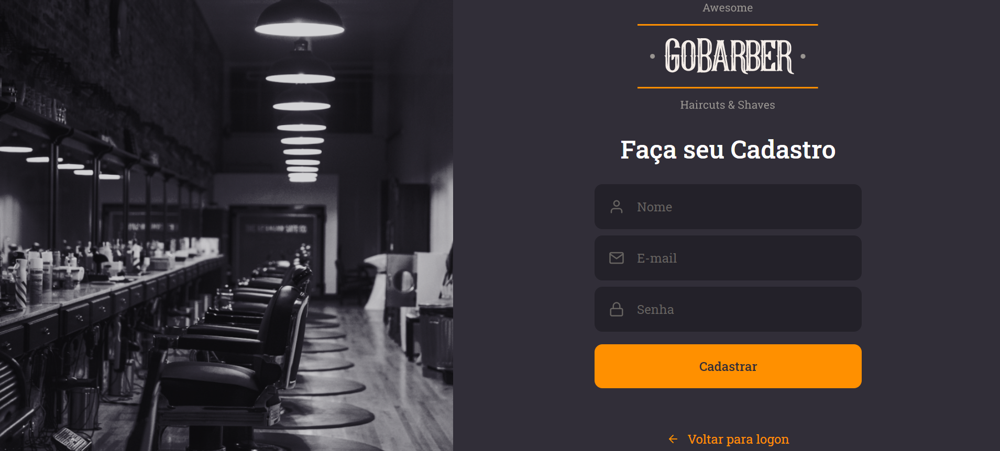
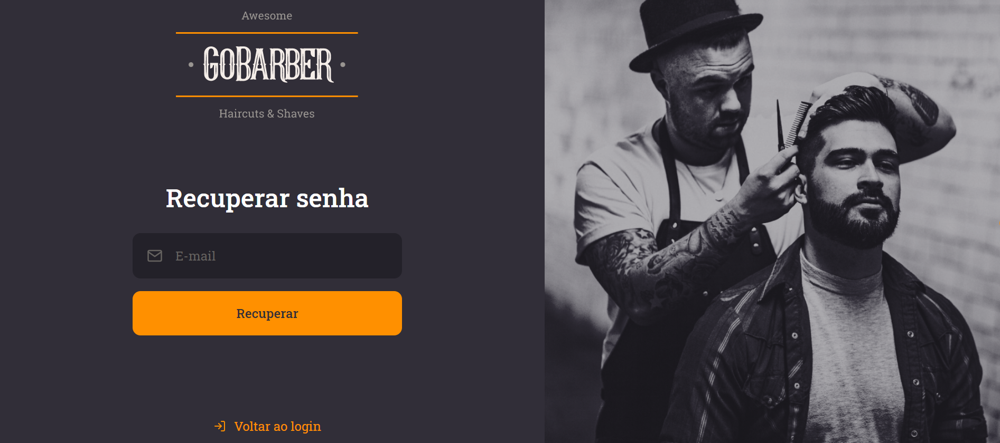
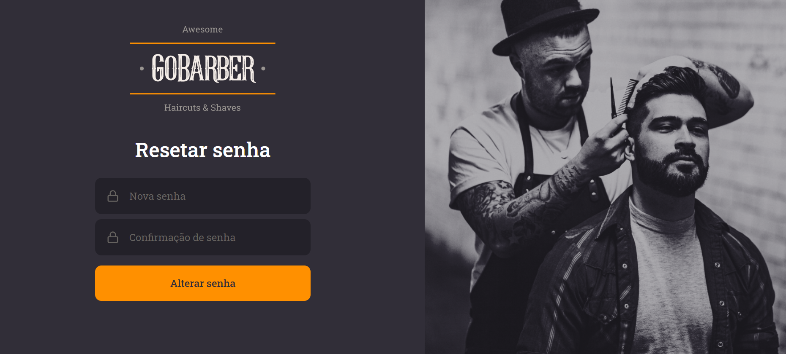
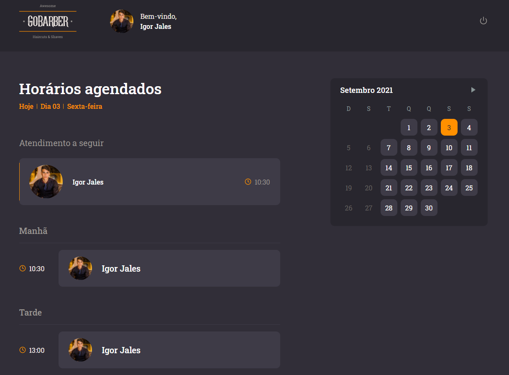
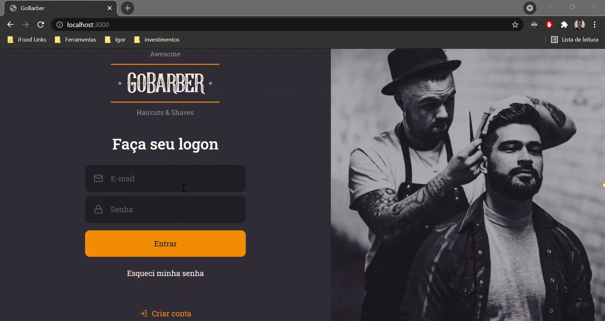
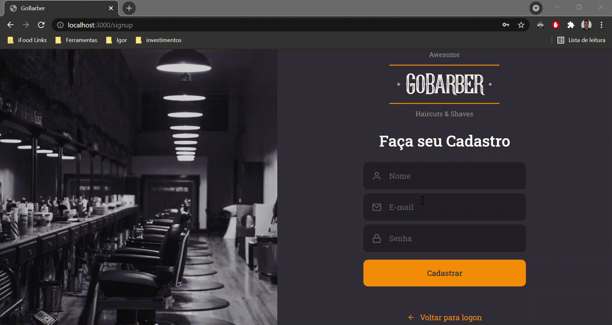
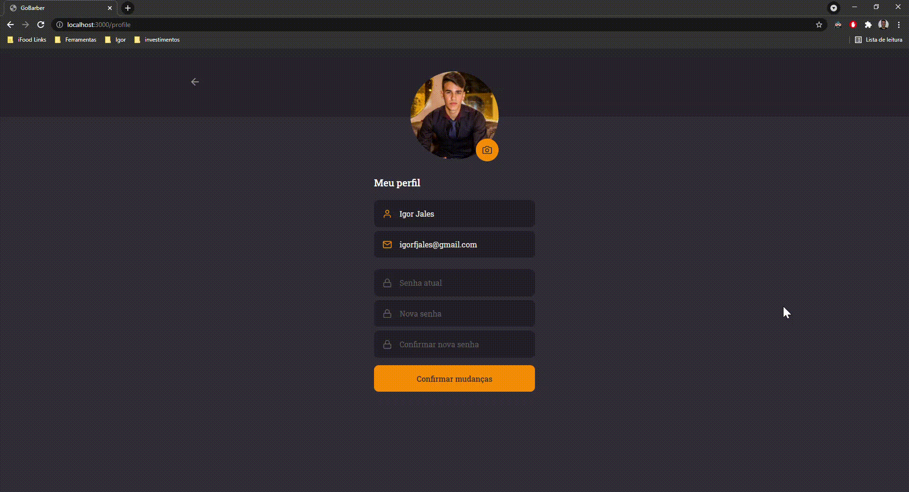

<h1 align="center">
    
</h1>

## 🚀 Tecnologias

Esse projeto foi desenvolvido com as seguintes tecnologias:

- [Typescript]
- [React]
- [React Hooks]
- [Context API]
- [Styled-components]
- [Unform]
- [React Spring]
- [Polished]
- [React-day-picker]
- [date-fns]
- [Axios]

## 💻 Sobre o Projeto

O GoBarber é uma aplicação que permite barbearias realizarem o cadastro de barbeiros e a gestão de agendamentos de serviços para clientes.

 

## Telas da Aplicação Web: 

### Tela de Login:

### Tela de Cadastro:

### Tela de Recuperação de senha:

### Tela de Reset de senha:

### Tela de Dashboard:

### Tela de Perfil:

### Toast Notifications, tratamento de erros e campos com highlight:

